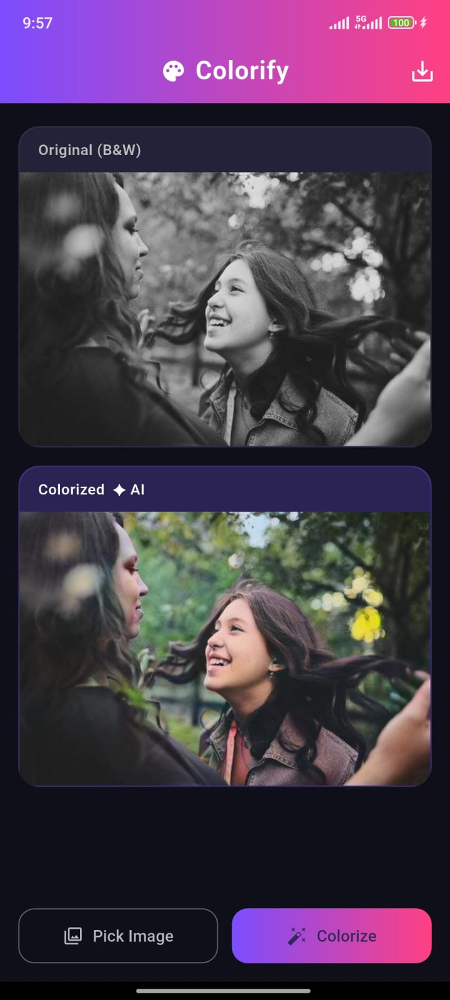

# Colorify

Aplikasi Android berbasis Flutter untuk **mewarnai foto hitam putih secara otomatis menggunakan AI**. Inferensi dijalankan sepenuhnya di perangkat (*on-device edge AI*) tanpa koneksi internet.

---

## Model AI

| Properti | Detail |
| -------- | ------ |
| **Model** | DDColor |
| **Format** | TensorFlow Lite (Float32) |
| **Ukuran** | ~215 MB |
| **Sumber** | [Qualcomm AI Hub — DDColor](https://huggingface.co/qualcomm/DDColor) |
| **Input** | Gambar grayscale 256×256 (dinormalisasi [0, 1]) |
| **Output** | Kanal warna *ab* CIE Lab 256×256, kemudian di-upsample ke resolusi asli |

> Model tidak disertakan di repository karena ukurannya melebihi batas GitHub. Lihat bagian [Download Model](#2-download-model) di bawah.

---

## Setup

### Prasyarat

- [Flutter SDK](https://docs.flutter.dev/get-started/install) versi 3.x (Dart ≥ 3.0)
- Android Studio / VS Code dengan ekstensi Flutter & Dart
- Perangkat Android (API 24 / Android 7.0 ke atas) atau emulator
- Python `pip` (opsional, untuk mengunduh model via CLI)

---

### 1. Clone Repository

```bash
git clone https://github.com/Rizqi1580/colorify-app.git
cd colorify-app
```

---

### 2. Download Model

Model harus diunduh secara terpisah dan ditempatkan di folder yang tepat.

**Unduh file berikut:**

[ddcolor.tflite — Hugging Face](https://qaihub-public-assets.s3.us-west-2.amazonaws.com/qai-hub-models/models/ddcolor/releases/v0.53.1/ddcolor-tflite-float.zip) (~215 MB)

Unzip lalu pindahkan file tflite.

**Letakkan file di:**

```text
colorify-app/
└── assets/
    └── models/
        └── ddcolor.tflite
```

> Jika folder belum ada, buat secara manual.

**Cara cepat via PowerShell (Windows):**

```powershell
Invoke-WebRequest -Uri "https://qaihub-public-assets.s3.us-west-2.amazonaws.com/qai-hub-models/models/ddcolor/releases/v0.53.1/ddcolor-tflite-float.zip" `
  -OutFile "assets/models/ddcolor.tflite"
```

**Via curl (Linux/macOS/Git Bash):**

```bash
curl -L "https://qaihub-public-assets.s3.us-west-2.amazonaws.com/qai-hub-models/models/ddcolor/releases/v0.53.1/ddcolor-tflite-float.zip" \
  -o assets/models/
```

---

### 3. Install Dependencies

```bash
flutter pub get
```

---

### 4. Jalankan di Android

Sambungkan perangkat Android (aktifkan USB Debugging) atau jalankan emulator, lalu:

```bash
flutter run
```

Untuk build APK release:

```bash
flutter build apk --release
```

File APK tersedia di `build/app/outputs/flutter-apk/app-release.apk`.

---

## Cara Penggunaan

1. Buka aplikasi — model AI akan dimuat otomatis di background (~5–10 detik pertama kali).
2. Tap **Pick Image** untuk memilih foto hitam putih dari galeri.
3. Tap **Colorize** untuk menjalankan pewarnaan AI.
4. Hasil tampil di bawah foto asli. Tap ikon **simpan** di kanan atas untuk menyimpan ke galeri.

---

## Teknologi

- **Flutter** — UI framework lintas platform
- **tflite_flutter** — Inferensi TFLite on-device
- **image** — Pemrosesan gambar & konversi ruang warna CIE Lab
- **image_picker** — Akses galeri perangkat
- **gal** — Simpan gambar ke galeri Android

---


